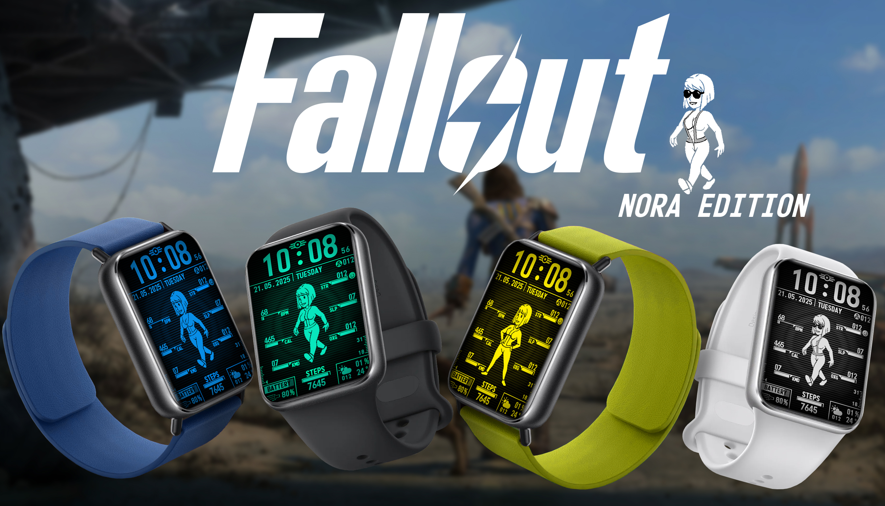

<!-- TOC -->
* [Fallout PipGirl (PipBoy) watchface for Mi Band 9/8 Pro](#fallout-pipgirl-pipboy-watchface-for-mi-band-98-pro)
  * [Colors](#colors)
  * [Styles](#styles)
    * [Animated](#animated)
    * [Static](#static)
  * [Data](#data)
  * [Tap-zones](#tap-zones)
  * [Files](#files)
    * [Cian](#cian)
    * [Blue](#blue)
    * [Yellow](#yellow)
    * [Gray](#gray)
    * [Ninja Gray](#ninja-gray)
    * [Orange](#orange)
    * [Fuchsia](#fuchsia)
    * [Blueberry Yogurt](#blueberry-yogurt)
  * [How to Install](#how-to-install)
  * [How to modify these watchface?](#how-to-modify-these-watchface)
    * [Recommendations](#recommendations)
    * [Changing color](#changing-color)
<!-- TOC -->
# Fallout PipGirl (PipBoy) watchface for Mi Band 9/8 Pro

Fallout inspired, PipBoy style watchface for MiBand 9 pro! Compatible with Mi Band 8 pro

## Colors

<h3 style="text-align:center;">Available in 8 colors!</h3>

<table align="center">
  <tr>
    <td align="center">
      
Blue

      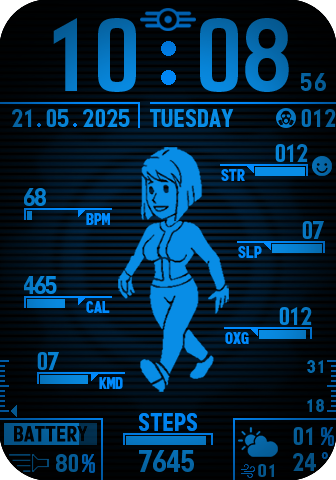
    </td>
    <td align="center">
      
Yellow

      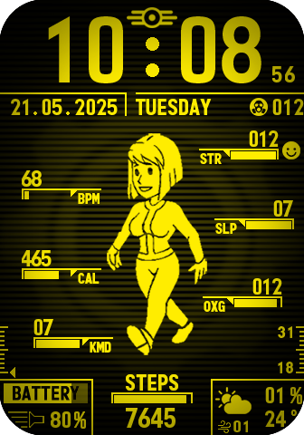
    </td>
    <td align="center">
      
Gray

      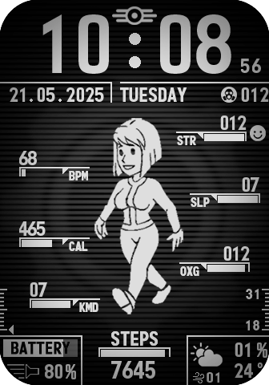
    </td>
    <td align="center">
      
Ninja Gray

      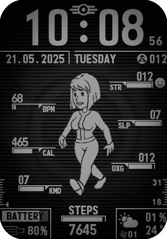
    </td>
  </tr>
  <tr>
    <td align="center">
      
Orange

      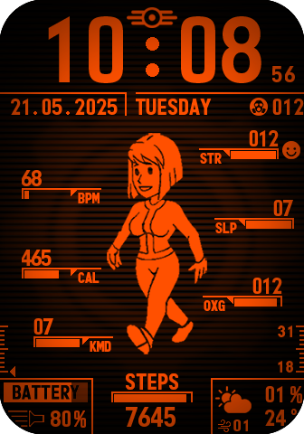
    </td>
    <td align="center">
      
Cyan

      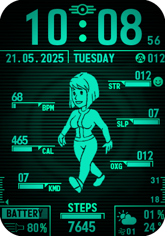
    </td>
    <td align="center">
      
Fuchsia

      
    </td>
    <td align="center">
      
Blueberry Yogurt

      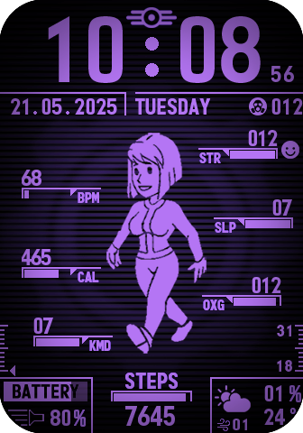
    </td>
  </tr>
</table>

## Styles

<h3 style="text-align:center;">Animated PipGirl!</h3>

  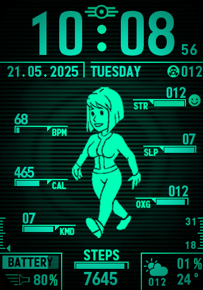

Inspired by [Vault Girl Mod - Neo's FOMOD Version](https://www.nexusmods.com/fallout4/mods/38220)

### Animated

<h3 style="text-align:center;">3 animations styles!</h3>

  
  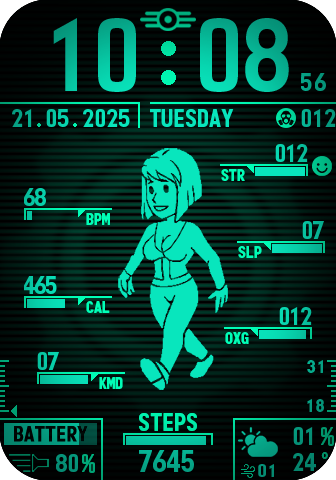
  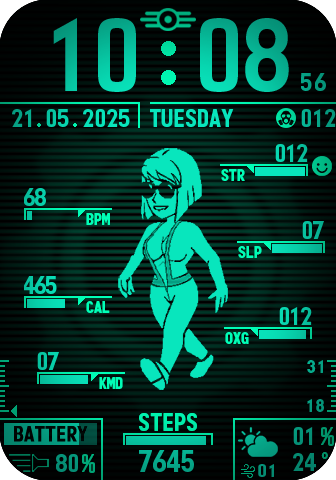

### Static

<h3 style="text-align:center;">1 additional static version!</h3>

  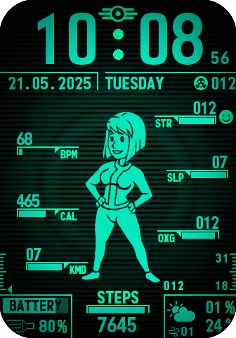

## Data

  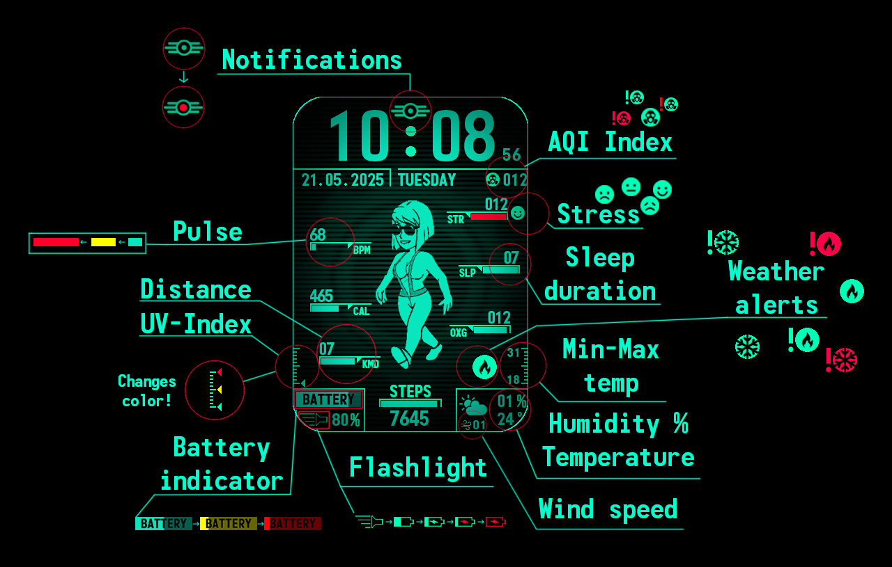

## Tap-zones

  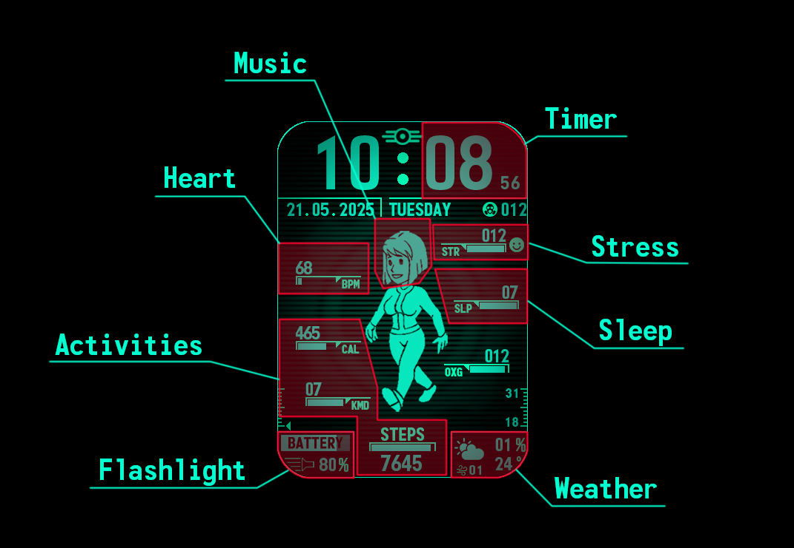

## Files

Each color has 2 watchface files:

1. Static VaultGirl + Animation decently dressed
2. Animation with a neckline + Animation pants + suspenders

This is due to a heavy files, Mi Band can not handle too many animations. You can select desired animation style 
with watchface settings, and you can install all of them!

*Note: All these clock-faces were tested on Mi Band 9 Pro, but they should work on Mi Band 8 Pro as well.*

### Cian

[Static VaultGirl + Animation decently dressed](share/V10/watchfaces/Cian_VaultGirl_v10_1.face)

[Animation with a neckline + Animation suspenders](share/V10/watchfaces/Cian_VaultGirl_v10_2.face)

### Blue

[Static VaultGirl + Animation decently dressed](share/V10/watchfaces/Blue_VaultGirl_v10_1.face)

[Animation with a neckline + Animation suspenders](share/V10/watchfaces/Blue_VaultGirl_v10_2.face)

### Yellow

[Static VaultGirl + Animation decently dressed](share/V10/watchfaces/Yellow_VaultGirl_v10_1.face)

[Animation with a neckline + Animation suspenders](share/V10/watchfaces/Yellow_VaultGirl_v10_2.face)

### Gray

[Static VaultGirl + Animation decently dressed](share/V10/watchfaces/Gray_VaultGirl_v10_1.face)

[Animation with a neckline + Animation suspenders](share/V10/watchfaces/Gray_VaultGirl_v10_2.face)

### Ninja Gray

[Static VaultGirl + Animation decently dressed](share/V10/watchfaces/Ninja_Gray_VaultGirl_v10_1.face)

[Animation with a neckline + Animation suspenders](share/V10/watchfaces/Ninja_Gray_VaultGirl_v10_2.face)

### Orange

[Static VaultGirl + Animation decently dressed](share/V10/watchfaces/Orange_VaultGirl_v10_1.face)

[Animation with a neckline + Animation suspenders](share/V10/watchfaces/Orange_VaultGirl_v10_2.face)

### Fuchsia

[Static VaultGirl + Animation decently dressed](share/V10/watchfaces/Fuchsia_VaultGirl_v10_1.face)

[Animation with a neckline + Animation suspenders](share/V10/watchfaces/Fuchsia_VaultGirl_v10_2.face)

### Blueberry Yogurt

[Static VaultGirl + Animation decently dressed](share/V10/watchfaces/Blueberry_VaultGirl_v10_1.face)

[Animation with a neckline + Animation suspenders](share/V10/watchfaces/Blueberry_VaultGirl_v10_2.face)

## How to Install

I was using [Notify for Mi Band & Xiaomi](https://play.google.com/store/apps/details?id=com.mc.xiaomi1&hl=en),
but there are other ways too.

Here a short instruction:

0. Tested on Galaxy S25, Mi Band 9 Pro
1. If you have Mi Fitness (official app) installed:
- Long press on App's icon 
- Open settings 
- Turn "Nearby Devices" off 
- Close Mi Fitness
2. Install Notify for Mi Band & Xiaomi (orange one, blue one for older Mi Band versions)
3. Do what it wants, save your pair-key, don't sync data to Notify for Mi Band & Xiaomi
4. Go directly to watchfaces tab, install one-by-one all watchfaces you want:
- Use install custom from .bin, it works fine with .face files 
- Install one by one, then open watchface to check if installed successfully, reinstall if needed 
- In my case Mi Band was occasionally freezing for a minute or so, then restarted itself 
- To avoid freezes – give it a time! Mi Band reads each installed WatchFace to obtain preview, which takes a second
5. Notify for Mi Band & Xiaomi don't provide weather, so uninstall it after you done
6. Allow Mi Fitness (official app) to use "Nearby Devices"
7. Sync data with Mi Fitness
8. Done!

## How to modify these watchface?

I was using MiCreate on Windows 11, I ttok it from here, it is .exe:

https://4pda.to/forum/index.php?showtopic=1076706&st=740#entry135696472

[Same file in this repo](MiCreate.exe)

It needs to be installed. I was not able to open watchface-project files with 
[EasyFace](https://github.com/m0tral/EasyFace), seems like these 2 apps does not support each other's files.

You can find source files for each watchface in this repo, including images:

[watchfaces](watchfaces_src)

[images](media_src)

**IMPORTANT** This exact version of MiCreate can only build for MiBand 8 pro for some reason. But, it works just fine
with pro 9, so build for Pro 8. Or use any other software

### Recommendations

- Use this wiki as an instruction for MiCreate: https://github.com/m0tral/EasyFace (same for MiCreate and EasyFace)
- I was only able to build 2 color into a single file
- With more than 2 WatchFace Mi Band can not install a file (probably due file size)
- To pack several watchfaces into a single file, create 2 project files (.fprj) in the same folder and build from MiCreate using any of them
- You need to have a folder 'images' with all media, used for a watchface, right next to project file (.fprj)
- You must have a file example.png in images folder, it should be 336x480 to build a watchface
- MiCreate is full of bugs
- Save all you data by literally copying project file to another folder
- In case of any error message, there is 50/50 chance that your current project-file is corrupted, no matter what you do next
- No, saving project with "save" button will not help – save project file to another place, when you sure it's buildable

### Changing color

If you familiar with Python, you can change color [with this](python_tools/color_changer.py)
[Get convertable images from here](media_src/CONVERTABLE_IMAGES/AUTOMATIC) all there images can be converted with that
script. [These images](media_src/CONVERTABLE_IMAGES/COMMON) can typically stay the same for any watchface color.
[And these image](media_src/CONVERTABLE_IMAGES/MANUAL) need to be converted manually using photoshop or similar tool.

[These 3 folders](media_src/CONVERTABLE_IMAGES) are all the images used for each of my watchfaces. After converting them
to a color you like, place them in a folder images [for any watchface in here](watchfaces_src) and open any of the
project file, for example [this one](watchfaces_src/PipGirlProject/PipGirlProject_d.fprj). It will automatically 
apply your images with new color. Now you can build new watchface using MiCrate.

Note, that you will also need to change Watchface ID under 'File' -> 'Manage project'. Each watchface should have 
unique name, or it will replace already installed one with the same ID.
