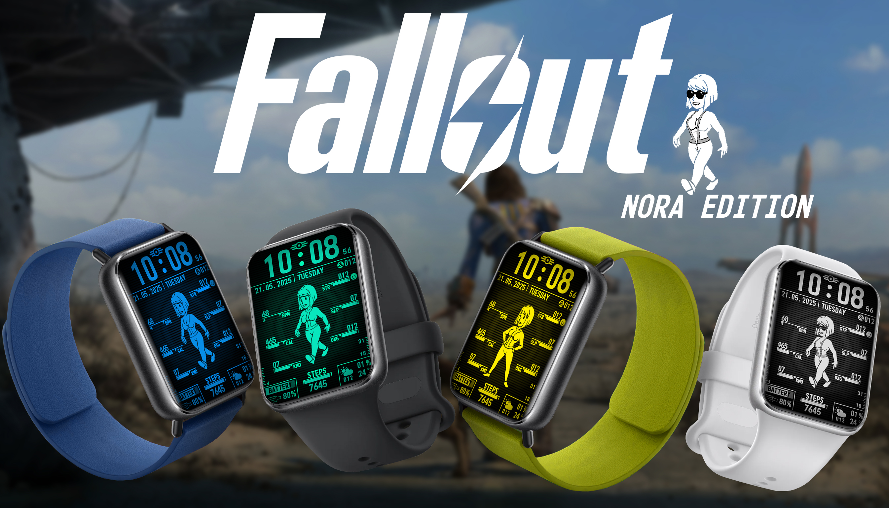

<!-- TOC -->
* [Fallout PipGirl (PipBoy) watchface for Mi Band 9/8 Pro](#fallout-pipgirl-pipboy-watchface-for-mi-band-98-pro)
  * [Colors](#colors)
  * [Styles](#styles)
    * [Animated](#animated)
    * [Static](#static)
  * [Data](#data)
  * [Tap-zones](#tap-zones)
  * [Download](#download)
    * [Cian](#cian)
    * [Blue](#blue)
    * [Yellow](#yellow)
    * [Gray](#gray)
    * [Ninja Gray](#ninja-gray)
    * [Orange](#orange)
    * [Fuchsia](#fuchsia)
    * [Blueberry Yogurt](#blueberry-yogurt)
    * [Ocean Blue (NSFW)](#ocean-blue-nsfw)
    * [Meadow Green (NSFW)](#meadow-green-nsfw)
    * [Armor Green (NSFW)](#armor-green-nsfw)
    * [Shameless Red (NSFW)](#shameless-red-nsfw)
    * [Toxic Green (NSFW)](#toxic-green-nsfw)
    * [Monroe Yellow (NSFW)](#monroe-yellow-nsfw)
    * [Velma Orange (NSFW)](#velma-orange-nsfw)
    * [Fionna Blue (NSFW)](#fionna-blue-nsfw)
    * [Tatsumaki Green (NSFW)](#tatsumaki-green-nsfw)
  * [How to Install](#how-to-install)
  * [How to modify these watchface?](#how-to-modify-these-watchface)
    * [Recommendations](#recommendations)
    * [Changing color](#changing-color)
  * [FAQ](#faq)
  * [Known issues](#known-issues)
<!-- TOC -->
# Fallout PipGirl (PipBoy) watchface for Mi Band 9/8 Pro

Fallout inspired, PipBoy style watchface for MiBand 9 pro! Compatible with Mi Band 8 pro

## Colors

<h3 style="text-align:center;">Available in 17 colors!</h3>

<table align="center">
  <tr>
    <td align="center">
      
Blue

      <a href="share/V10/watchfaces/Blue">
        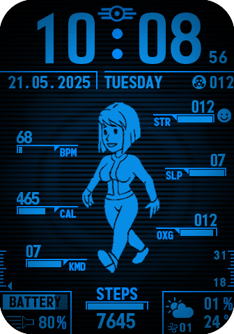
      </a>
    </td>
    <td align="center">
      
Yellow

      <a href="share/V10/watchfaces/Yellow">
        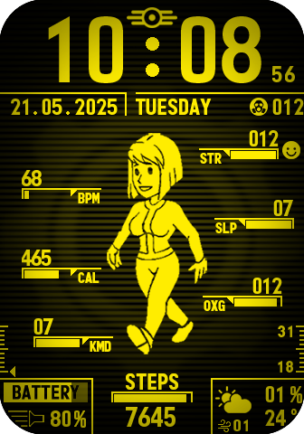
      </a>
    </td>
    <td align="center">
      
Gray

      <a href="share/V10/watchfaces/Gray">
        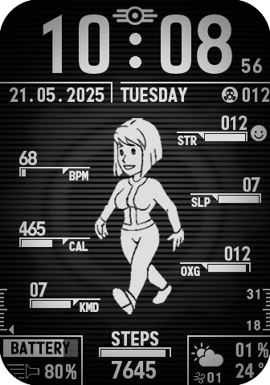
      </a>
    </td>
    <td align="center">
      
Ninja Gray

      <a href="share/V10/watchfaces/Ninja">
        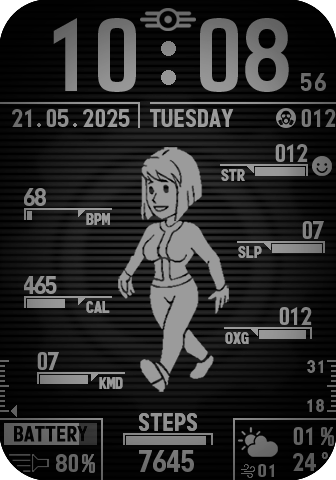
      </a>
    </td>
  </tr>
  <tr>
    <td align="center">
      
Orange

      <a href="share/V10/watchfaces/Orange">
        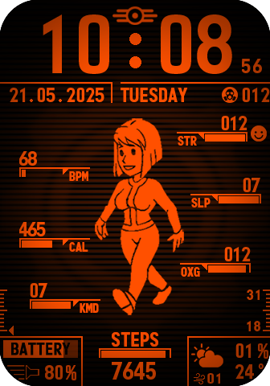
      </a>
    </td>
    <td align="center">
      
Cyan

      <a href="share/V10/watchfaces/Cian">
        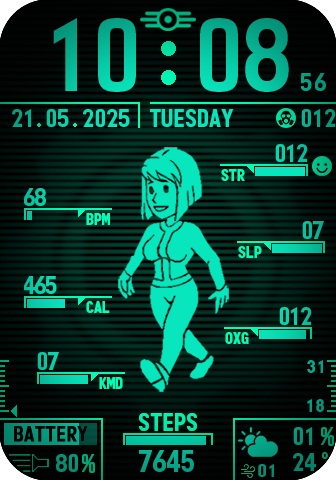
      </a>
    </td>
    <td align="center">
      
Fuchsia

      <a href="share/V10/watchfaces/Fuchsia">
        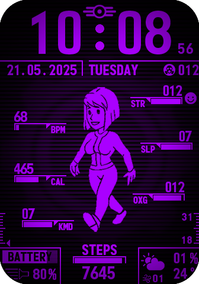
      </a>
    </td>
    <td align="center">
      
Blueberry Yogurt

      <a href="share/V10/watchfaces/BlueberryYogurt">
        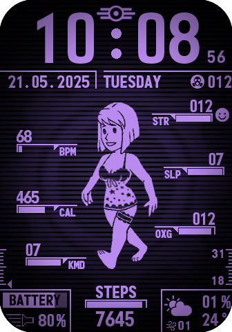
      </a>
    </td>
  </tr>
  <tr>
    <td align="center">
      
Ocean Blue

      
    </td>
    <td align="center">
      
Meadow Green

      
    </td>
    <td align="center">
      
Armor Green

      <a href="share/V10/watchfaces/ArmorGreen">
        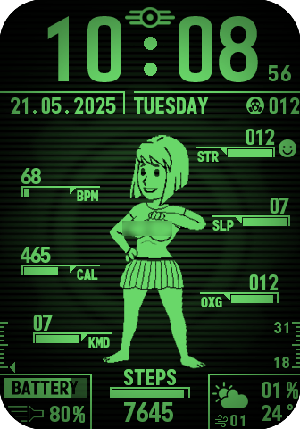
      </a>
    </td>
    <td align="center">
      
Shameless Red

      <a href="share/V10/watchfaces/ShamelessRed">
        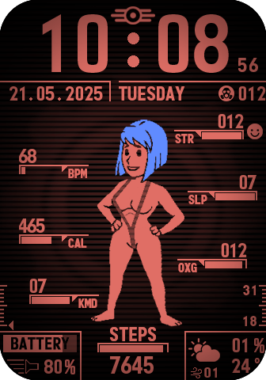
      </a>
    </td>
  </tr>
  <tr>
    <td align="center">
      
Toxic Green

      
    </td>
    <td align="center">
      
Monroe Yellow

      <a href="share/V10/watchfaces/Monroe">
        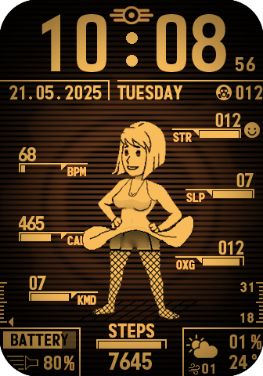
      </a>
    </td>
    <td align="center">
      
Velma Orange

      
    </td>
    <td align="center">
      
Fionna Blue

      <a href="share/V10/watchfaces/AdventureBlue">
        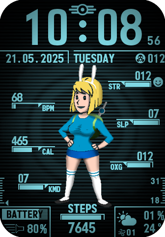
      </a>
    </td>
  </tr>
  <tr>
    <td align="center">
      
Tatsumaki Green

      <a href="share/V10/watchfaces/TatsumakiGreen">
        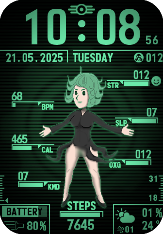
      </a>
    </td>
  </tr>
</table>

## Styles

<h3 style="text-align:center;">Animated PipGirl!</h3>

  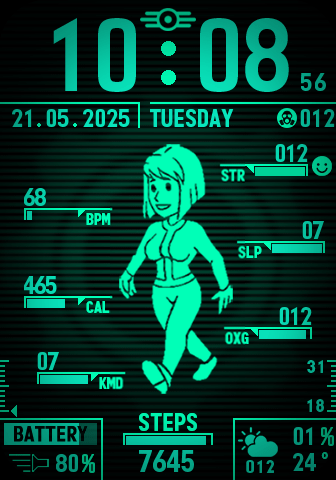

Inspired by [Vault Girl Mod - Neo's FOMOD Version](https://www.nexusmods.com/fallout4/mods/38220)

### Animated

<h3 style="text-align:center;">3 main animations styles!</h3>

  
  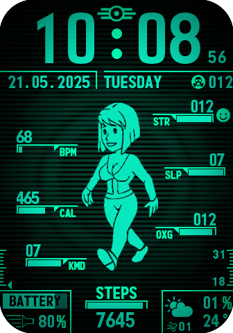
  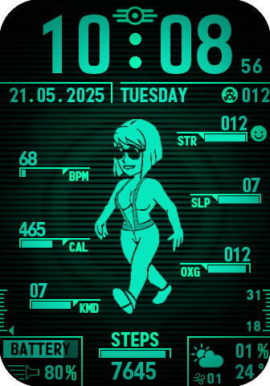

Different colors may have additional unique animations, for example:

  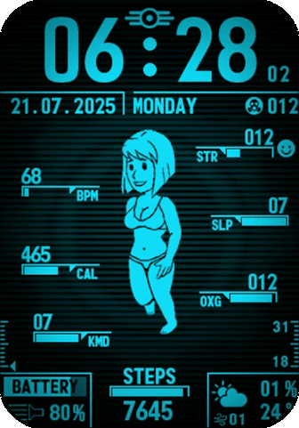
  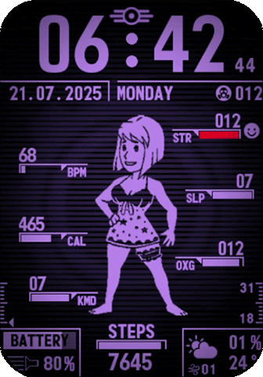

### Static

<h3 style="text-align:center;">1 additional static version!</h3>

  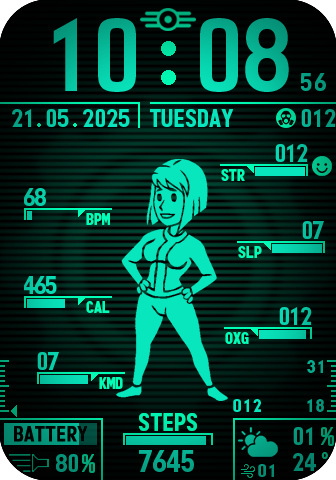

Different colors may have different static-image (static version of watchface, the one without animation), for example:

  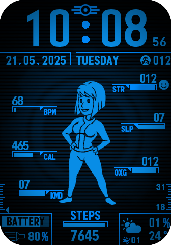
  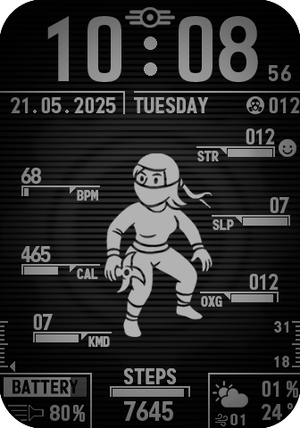
  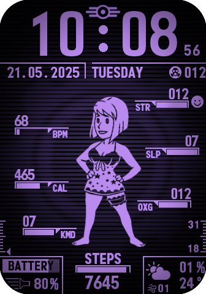

  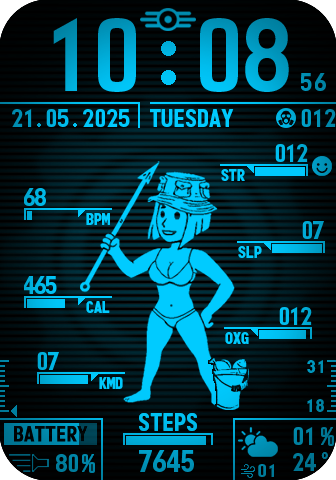
  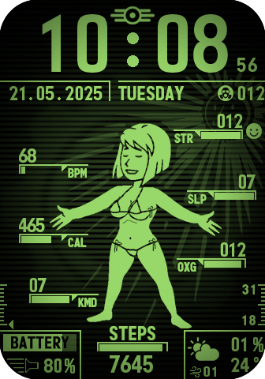
  

  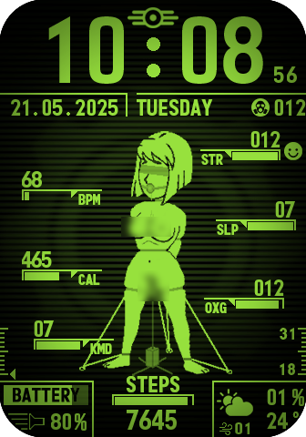
  
  

  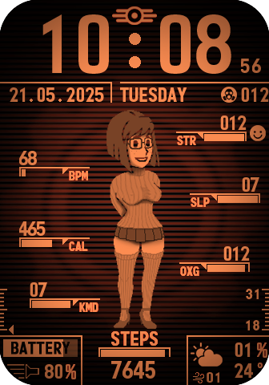

## Data

  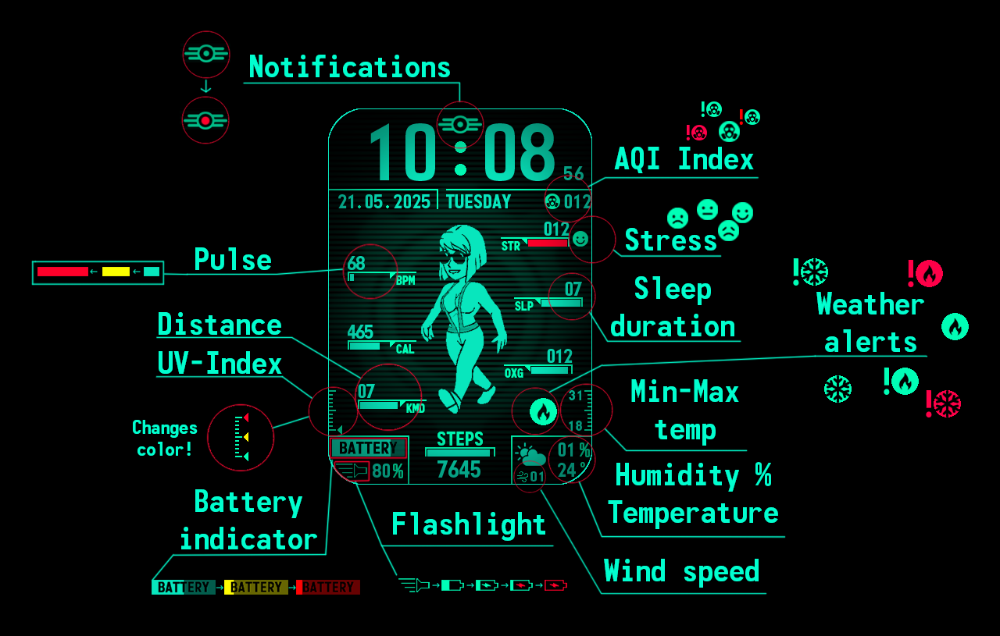

## Tap-zones

  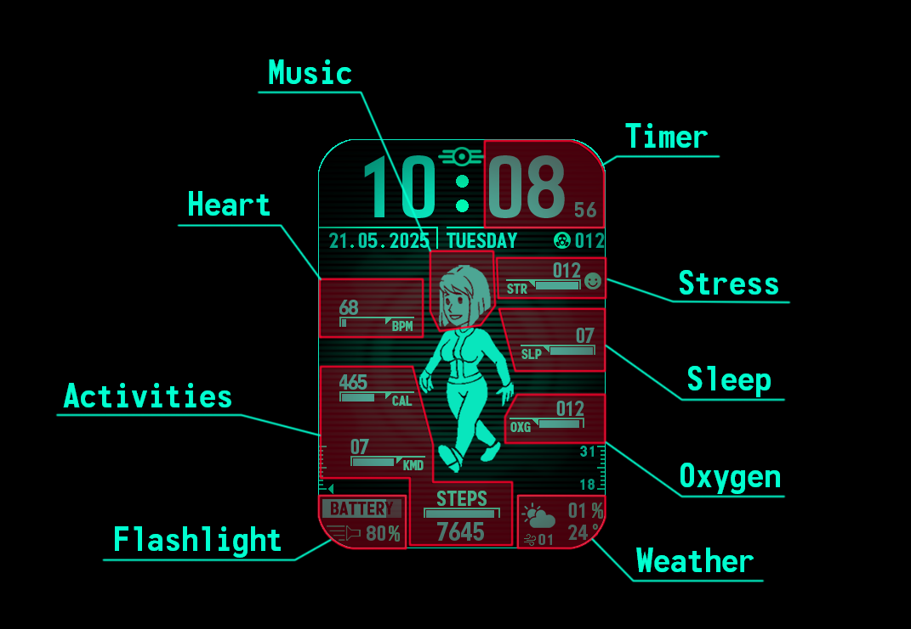

## Download

Each color has 2 to 4 watchfaces for MiBand 8/9, different by VaultGirl:

- Static VaultGirl (no animation)
- And animated versions

Static version may be a bit different from color to color.

All animated versions may be a bit (sometimes a lot) different, but it always a VaultGirl taking some actions,
normally simply walking in different clothes (sometimes NSFW clothes).

Each color has a single watchface-file. You can select style of animation (or static version) on MiBand itself by
configuring watchface with a button "settings" when selecting watchface.

*Note: All these clock-faces were tested on Mi Band 9 Pro, but they should work on Mi Band 8 Pro as well.*

### Cian

[Watchface file is here](share/V10/watchfaces/Cian) <- Download

Includes:
- Static VaultGirl
- Animation Decently Dressed 
- Animation With A neckline (decollete)
- Animation Suspenders

### Blue

[Watchface file is here](share/V10/watchfaces/Blue) <- Download

Includes:
- Static VaultGirl
- Animation Decently Dressed 
- Animation With A neckline (decollete)
- Animation Suspenders

### Yellow

[Watchface file is here](share/V10/watchfaces/Yellow) <- Download

Includes:
- Static VaultGirl
- Animation Decently Dressed 
- Animation With A neckline (decollete)
- Animation Suspenders

### Gray

[Watchface file is here](share/V10/watchfaces/Gray) <- Download

Includes:
- Static VaultGirl
- Animation Decently Dressed 
- Animation With A neckline (decollete)
- Animation Suspenders

### Ninja Gray

[Watchface file is here](share/V10/watchfaces/Ninja) <- Download

Includes:
- Static VaultGirl (Ninja-style)
- Animation Decently Dressed 
- Animation With A neckline (decollete)
- Animation Suspenders

### Orange

[Watchface file is here](share/V10/watchfaces/Orange) <- Download

Includes:
- Static VaultGirl
- Animation Decently Dressed 
- Animation With A neckline (decollete)
- Animation Suspenders

### Fuchsia

[Watchface file is here](share/V10/watchfaces/Fuchsia) <- Download

Includes:
- Static VaultGirl
- Animation Decently Dressed 
- Animation With A Neckline (decollete)
- Animation Suspenders

### Blueberry Yogurt

[Watchface file is here](share/V10/watchfaces/BlueberryYogurt) <- Download

Includes:
- Static VaultGirl (Nightie)
- Animation Stretching 
- Animation Walking In Nightie
- Animation Suspenders

### Ocean Blue (NSFW)

[Watchface file is here](share/V10/watchfaces/Ocean) <- Download

Includes:
- Static VaultGirl (Fisher-Girl)
- Animation Walking In Swimsuit
- Animation Lustful Octopus (NSFW)

### Meadow Green (NSFW)

[Watchface file is here](share/V10/watchfaces/Meadow) <- Download

Includes:
- Static VaultGirl (Sunbathing)
- Animation Yawning (NSFW)
- Animation Walking in Bikini

### Armor Green (NSFW)

[Watchface file is here](share/V10/watchfaces/ArmorGreen) <- Download

Includes:
- Static VaultGirl in Skirt (NSFW)
- Animation Jumping in Skirt (NSFW)
- Animation Walking in Skirt (NSFW)

### Shameless Red (NSFW)

[Watchface file is here](share/V10/watchfaces/ShamelessRed) <- Download

Includes:
- Static VaultGirl (Shameless Suspenders)
- Animation Tears Suspenders (NSFW)
- Animation Squeezing Boobs (NSFW)
- Animation Walking In Shameless Suspenders (NSFW)

### Toxic Green (NSFW)

[Watchface file is here](share/V10/watchfaces/ToxicGreen) <- Download

Includes:
- Static VaultGirl F@@k-Machine (NSFW)
- Animation F@@k-Machine (NSFW)
- Animation Walking In Bondage (NSFW)

### Monroe Yellow (NSFW)

[Watchface file is here](share/V10/watchfaces/Monroe) <- Download

Includes:
- Static VaultGirl Monroe On A Vent (NSFW)
- Animation Monroe On A Vent (NSFW)
- Animation Monroe Walking
- Animation Monroe Walking (NSFW)

### Velma Orange (NSFW)

[Watchface file is here](share/V10/watchfaces/Velma) <- Download

Includes:
- Static VaultGirl Velma Style
- Animation Velma Using Device (NSFW)
- Animation Velma Using Vibrator (NSFW)

### Fionna Blue (NSFW)

[Watchface file is here](share/V10/watchfaces/AdventureBlue) <- Download

Includes:
- Static VaultGirl Fionna Style (Adventure Time)
- Animated VaultGirl Fionna Style (NSFW)

### Tatsumaki Green (NSFW)

[Watchface file is here](share/V10/watchfaces/TatsumakiGreen) <- Download

Includes:
- Static VaultGirl Tatsumaki Style (Adventure Time)
- Animated VaultGirl Tatsumaki Style (NSFW)

## How to Install

I was using [Notify for Mi Band & Xiaomi](https://play.google.com/store/apps/details?id=com.mc.xiaomi1&hl=en),
but there are other ways too.

- Notify for Mi Band & Xiaomi (NfMBX) – third party app, orange one
- Mi Fitness – official app

Here a short instruction:

0. Tested on Galaxy S25, Mi Band 9 Pro
1. If you have Mi Fitness (official app) installed:
- Sync data from MiBand to Mi Fitness (official app)
- Long press on App's icon 
- Open settings 
- Turn "Nearby Devices" off (to let NfMBX connect to MiBand)
- Close Mi Fitness (completely, swipe in away in 'recent apps')
2. Install Notify for Mi Band & Xiaomi (orange one, blue one for older Mi Band versions)
3. Do what it wants, save your pair-key, don't sync data to Notify for Mi Band & Xiaomi
- It will ask you to provide credentials from Mi Fitness account to get pair-key
- If this app have troubles finding you Mi Band, you can use MAC Address of Mi Band (there is such option)
- MAC Address can be found on your Mi Band directly – open settings -> About -> MAC Address
4. When (if) connected go directly to watchfaces tab, install one-by-one all watchfaces you want:
- Use install custom from .bin, it works fine with .face files 
- Install one by one, each time open watchface to check if installed successfully, reinstall if needed 
- In my case Mi Band was occasionally freezing for a minute or so, then restarted itself 
- To avoid freezes – give it a time! Mi Band reads each installed WatchFace to obtain preview, which takes a second
5. Notify for Mi Band & Xiaomi don't provide weather, so uninstall it after you done
6. Allow Mi Fitness (official app) to use "Nearby Devices" again
7. Sync data with Mi Fitness
8. Done!

## How to modify these watchface?

I was using MiCreate on Windows 11, I took it from here, it is .exe:

https://4pda.to/forum/index.php?showtopic=1076706&st=740#entry135696472

[Same file in this repo](MiCreate.exe)

It needs to be installed. I was NOT able to open watchface-project files with 
[EasyFace](https://github.com/m0tral/EasyFace), seems like these 2 apps does not support each other's files.

You can find source files for each watchface in this repo, including images:

[watchfaces](watchfaces_src)

[images](media_src)

For each color you can find a file of a watchface in 'output' folder, it has .face extension, for example:

[in this folder](watchfaces_src/PipGirlProject%20-%20Shameless%20Red/output)
[this file](watchfaces_src/PipGirlProject%20-%20Shameless%20Red/output/ShamelessRed_VaultGirl_v10.face)

Project-files for MiCreate have 4 versions:

- ...static.fprj – Static version (no animation)
- ...standard.fprj – first animation style
- - ..._d.fprj – second animation style
- - ..._es.fprj – third animation style

**IMPORTANT** This exact version of MiCreate can only build for MiBand 8 pro for some reason. But, it works just fine
with pro 9, so build for Pro 8. Or use any other software.

**IMPORTANT** This exe-file of MiCreate is outdated. After installation, it will ask for update – do it! Newer version
(v1.1) has fever bugs and is able to build >2 watchfaces into a single .face file

### Recommendations

- Use this wiki as an instruction for MiCreate: https://github.com/m0tral/EasyFace/wiki/HomeEN (same for MiCreate and EasyFace)
- To pack several watchfaces into a single file, create several project files (.fprj) in the same folder and build from MiCreate using any of them
- You need to have a folder 'images' with all media, used for a watchface, right next to project file (.fprj)
- You must have a file example.png in images folder, it should be 336x480 to build a watchface
- MiCreate is full of bugs (fever bugs in v1.1)
- Save all your data by literally copying project file to another folder from time to time
- In case of any error message, there is 50/50 chance that your current project-file is corrupted, no matter what you do next
- No, saving project with "save" button will not help – save project file to another place, when you sure it's buildable

### Changing color

If you familiar with Python, you can change color [with this](python_tools/color_changer.py)

[Get convertable images from here](media_src/CONVERTABLE_IMAGES/AUTOMATIC) all these images can be converted with that
script (or manually, you expect to live forever)

[These images](media_src/CONVERTABLE_IMAGES/COMMON) should typically stay the same for any watchface color. This is because
there is yellow and red colors which are intended to stay this way in any watchface to indicate some information, like
low battery for example. You may recolor them too, but in this case your (for example) battery indicator will not 
become red (or yellow) at low charge.

[And these image](media_src/CONVERTABLE_IMAGES/MANUAL) need to be converted manually using photoshop or similar tool.
This is because there is a bit or red color, which intended to be a signaling color.

Overall [these 3 folders](media_src/CONVERTABLE_IMAGES) are all the images used for each watchface.

After converting them to a color you like, place them in a folder "images" [for any watchface in here](watchfaces_src)
(with replacing files) and open any of the project file, for example [this one](watchfaces_src/PipGirlProject/PipGirlProject_d.fprj) 
with MiCreate.

Note that you should be working in the same folder, so your project file should be in the same place, where you have just
replaced pictures in 'images' folder.

It will automatically apply your images (with new color) as they have the same names (so when changes colors of images, 
you should keep the names of each image as is). Now you can build new watchface using MiCrate – there is button 'build'.
MiCreate will build you file in the folder 'output', this will be .face file ,it will have the same name, as your project
file. For example if you opened a file 'PipGirlProject_es.fprj' and built it, you will have a file 'PipGirlProject_es.face'
in output folder.

Note, that you will also need to change Watchface ID under 'File' -> 'Manage project'. Each watchface should have 
unique ID, or it will replace already installed one with the same ID on you Mi Band (if there is such saved on Mi Band).

## FAQ

> **Does this watchface drains battery any faster?** 
> > Static version does not. With my settings (all on, set 1 minute screen on) static versions (no animation) drains from 100% to 20 in 10 days.
> > Animated version goes from 100% to 20% in 7 days, so given 350 mAh battery drained to 20% means 280 mAh used:
> > >  280 mAh \ 10 days = 28 mAh per day and 280 \ 7 = 40 mAh per day for animated version. Difference is 12 mAh a day,
> > > which is about ~3.4% a day of battery usage due to animation

> **Why so many colors?**
> > I have ordered a bunch of different straps for Mi Band, something like 15, and trying to match a color of 
> > watchface to each strap. So there probably would be more colors as more and more straps arriving)

> **Can you change color for me or do some other adjustments I want?**
> > Sure! Just [e-mail me](https://www.youtube.com/watch?v=dQw4w9WgXcQ) with what you want and I will send your watchface!

## Known issues

Sometimes MiBand copies animation (VaultGirl) into 5 - 10 instances, spreading them across the screen. In this case
open Watchface settings, swipe up-down to other animation version and set watchface again.

After first installation preview on MiBand is taken from Watchfaces' files. It looks a bit different from actual
watchface. MiBand resets preview after opening settings for concrete watchface and keeps it right after that.

Weather icons are not completely tested. Icons are set after 'weather index', and there a lots of them. I was not
able to find any complete description, so took some other watchface and copied its indices. There might be an issue
with weather icon, when it would display NOT the actual weather. I am currently collecting indices with their 
descriptions to see, if any are wrong. In static of Cian watchface 
[in here](watchfaces_src/PipGirlProject/output/Cian_VaultGirl_v10.face) watchface displays actual index it reads
from weather provider. This is how I keep track and compare indices. Collection them all might take a while) 
Here what I currently have:

- 004 – [Thunder + rain]
- 001 – [Partly cloudy]
- 008 – [Moderate rain]
- 000 – [Clear]

I was not able to create a button (Tap-Zone) for Oxygen. No idea why and how to do that.

There might be an issue with weather alerts for negative temperatures – did not test yet, waiting for winter)

No idea what would happen in case IV-index goes above 10. MiCreate crashes if trying to set a value for UV=11 or 
higher. Probably the bar will just stick to its upper limit, so should be ok.
